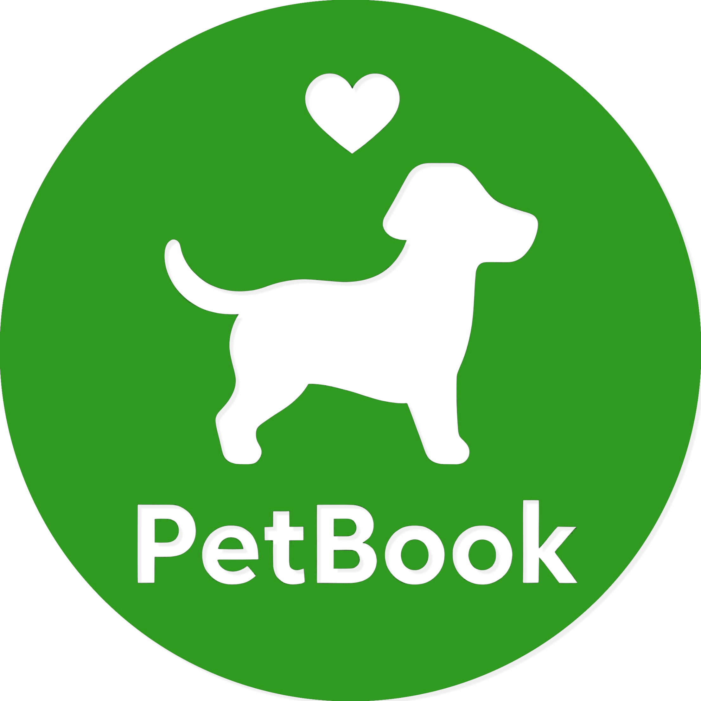

<a id="readme-top"></a>

<div align="center">
  <h1 align="center">PetBook</h1>
  <a href="https://github.com/Mazart23/pet_book">
    
  </a>
  <p align="center">
    PetBook is a web application for pet owners that facilitates pet reunification and content sharing. With PetBook, users can create profiles for their pets, post content, and, through a QR code linked to their pet's profile, make it easier for others to return lost pets to their owners.
  </p>
</div>

<br />

<!-- TABLE OF CONTENTS -->
<details>
  <summary>Table of Contents</summary>
  <ol>
    <li>
      <a href="#getting-started">Getting Started</a>
      <ul>
        <li><a href="#prerequisites">Prerequisites</a></li>
        <li><a href="#installation">Installation</a></li>
      </ul>
    </li>
  </ol>
</details>

## Getting Started

To run the application locally, follow the simple steps outlined below to set up your environment.

### Prerequisites

There are no additional prerequisites except docker with docker-compose tool (Docker Desktop on Windows/MacOS) to run application.

### Installation

1. **Clone the repo**  
   ```sh
   git clone https://github.com/Mazart23/pet_book.git
   ```  
2. **Navigate to the Project Directory**  
   ```sh
   cd pet-book
   ```  
3. **Configure Environment Variables**  
    Copy the example environment file to create a `.env` file:
   ```sh
   cp .env.example .env
   ```  
    Edit the `.env` file as needed for your setup.  
4. **Start Docker**  
    Ensure Docker engine is running on your machine.  
5. **Build and Run the Containers**  
    Launch the application with Docker Compose:
   ```sh
   docker-compose up --build
   ```  
6. **Access the Application**  
    Open your browser and go to `localhost:3000`.  
8. **Enjoy the Application!**  

<br/>

<p align="right">(<a href="#readme-top">back to top</a>)</p>
